<p align="center">
  
</p>

# Polaris Twin

**A digital twin for India's Antarctic stations, Maitri and Bharati.**

Polaris Twin brings each station's buildings, generators, fuel, stores, weather and crew into one live model, so the NCPOR control room in Goa and the crew on the ice see the same picture. It is **edge-first**: each station keeps working when the satellite link drops, queues its changes, and sends only small updates and alerts when the link returns. The project has a web dashboard for the control room, an Android app for the crew, and an AI copilot that answers in English or Hindi from live station data and the station SOPs.

Built by **Commit Crew** for **Smart India Hackathon 2026**, problem statement **PS 26060** (Ministry of Earth Sciences / NCPOR, theme Smart Automation).

> Prototype. Sensor values come from a simulated feed; nothing here is real NCPOR data.

## Live links

| | |
| --- | --- |
| Website (control room dashboard) | https://polaris-twin-psi.vercel.app |
| Android app (APK) | _link added after the EAS build_ |
| Demo video | _link added after recording_ |
| Printable shelf labels for the app's scanner | https://polaris-twin-psi.vercel.app/barcodes |

**Demo account:** `demo@polaristwin.app`. The password is shown on the login page and on the presentation.

## Screenshots

| Control room overview | 3D digital twin (Bharati) |
| --- | --- |
| 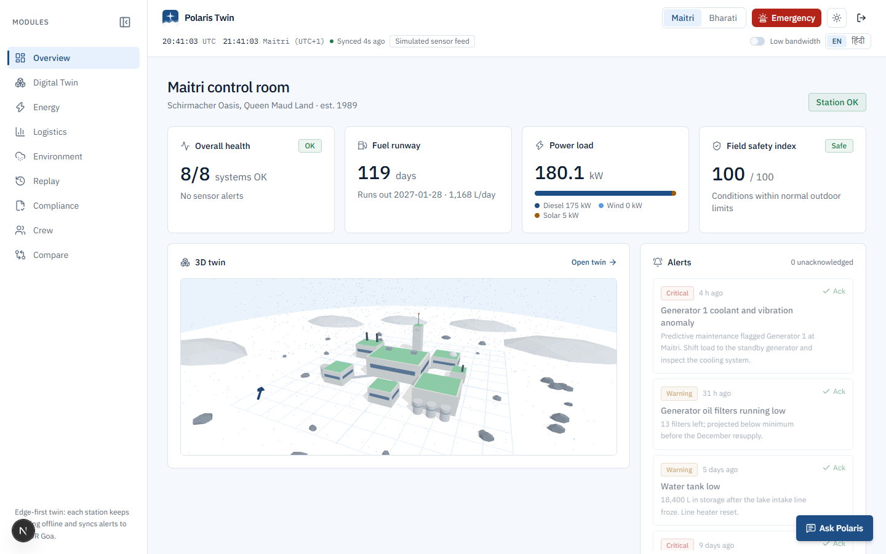 | 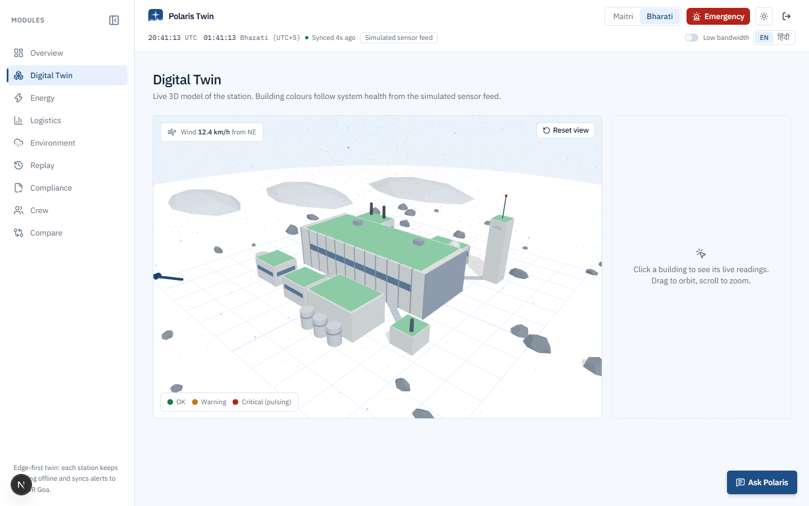 |
| **Energy and predictive maintenance** | **Logistics and fuel runway** |
| 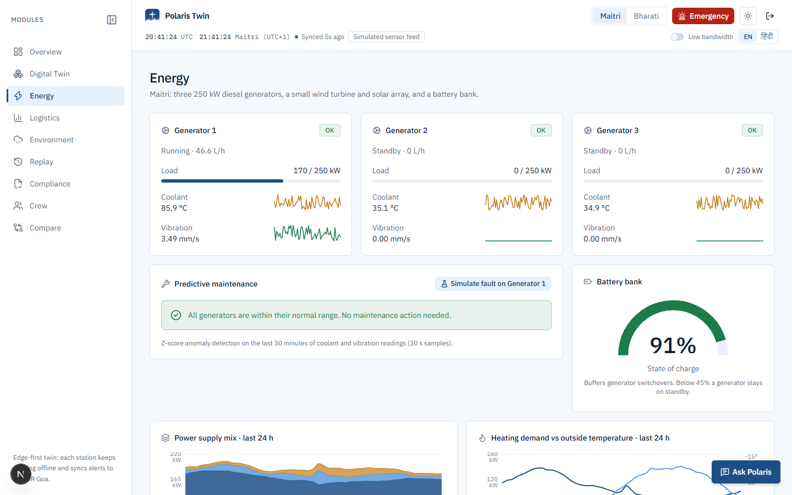 | 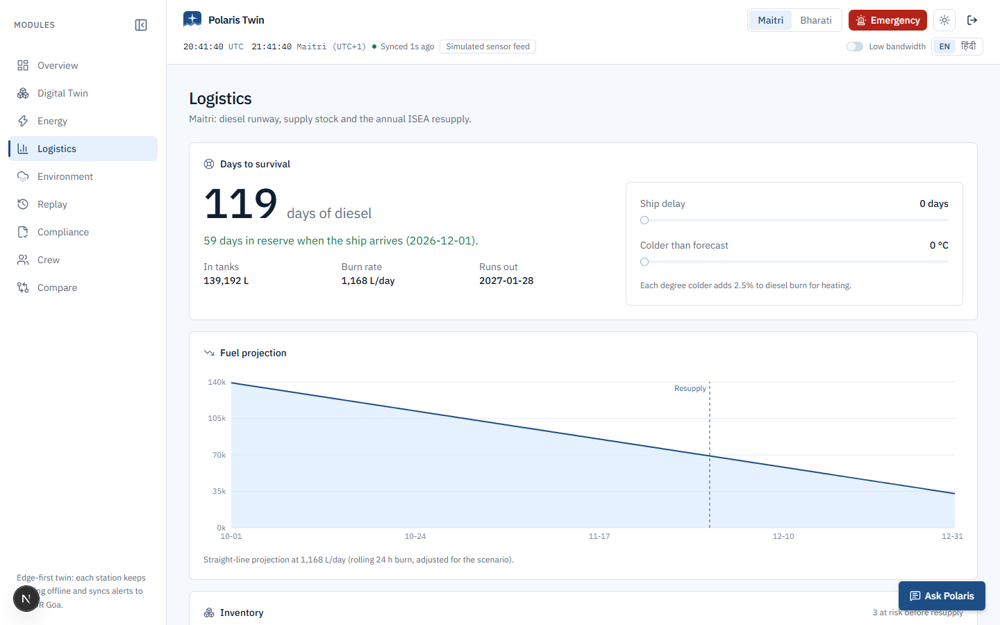 |
| **Maitri vs Bharati** | **Dark theme** |
| 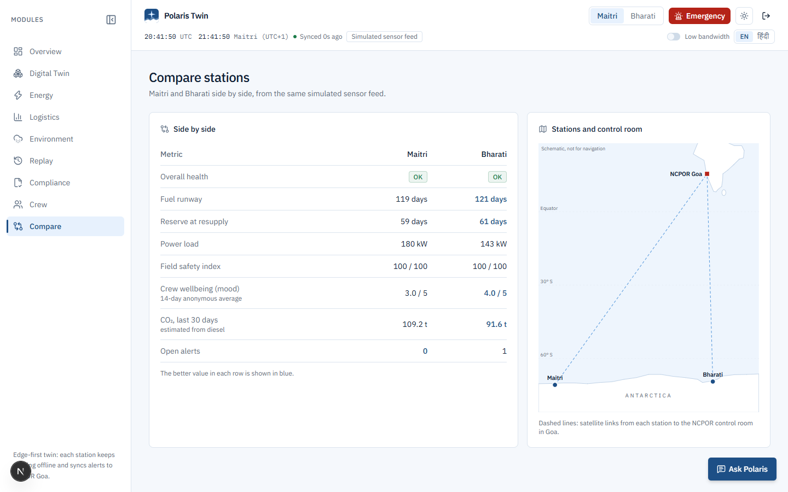 | 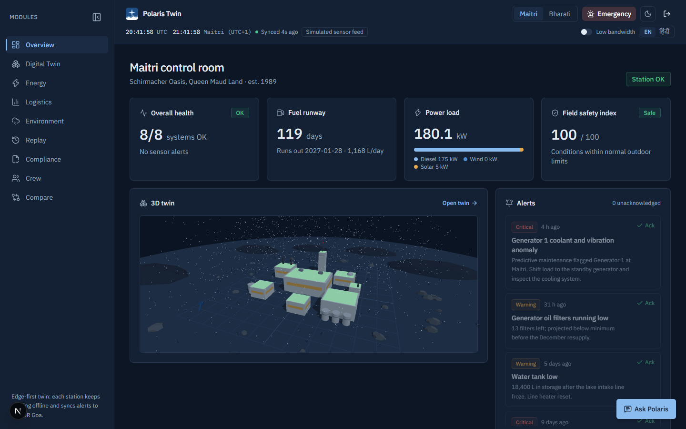 |

| Crew app: Home | Safety and field check-out | SOS | Dark theme |
| --- | --- | --- | --- |
| 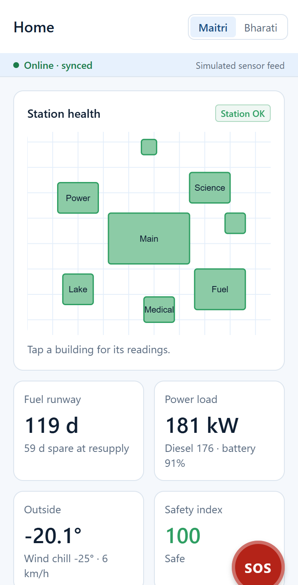 | 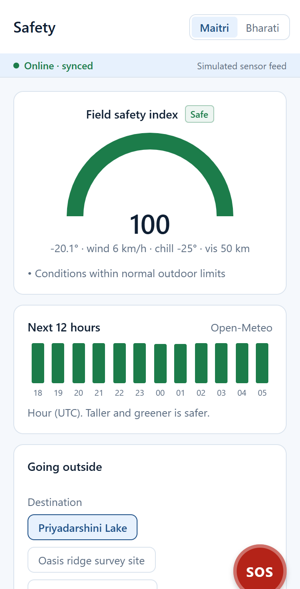 | 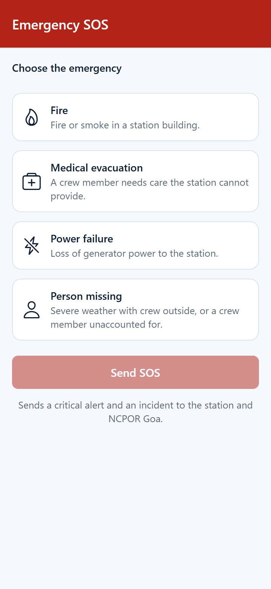 | 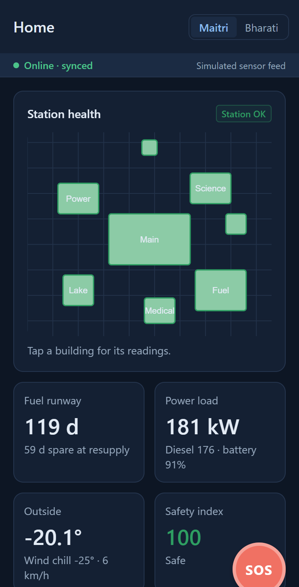 |

More images are in [`docs/screenshots/`](docs/screenshots/).

## What it does

### Web dashboard (NCPOR control room)
- **Overview:** station health, fuel runway, power load split (diesel / wind / solar), field safety index, live alerts with acknowledge (Supabase realtime), 10-minute trend charts, items at risk before resupply and a countdown to the ISEA ship.
- **3D digital twin:** low-poly model of each station with building colours following live health (critical buildings pulse red). It has snow driven by live wind, walkways, terrain and a polar-night scene in dark mode. Click a building for its readings, including each generator's load, coolant and vibration.
- **Energy:** generator cards with anomaly badges, z-score predictive maintenance with time to the critical limit, battery gauge, 24-hour supply mix and heating-versus-temperature charts.
- **Logistics:** "days to survival" with ship-delay and colder-weather sliders that turn red if fuel runs out before resupply, a fuel projection chart, and an inventory table with search, inline edits and "check the other station" for spares.
- **Environment:** live Open-Meteo weather and 48-hour forecast, safety gauge with reasons, and a go / no-go field-trip planner.
- **Replay:** 72-hour timeline with alert markers and 1x / 10x / 60x playback of station state.
- **Compliance:** CO₂, diesel, waste and spill figures under the Madrid Protocol / Indian Antarctic Act 2022, a register form, and a printable report.
- **Crew:** anonymous wellbeing trends (5-day averages, hidden below 3 responses), low-mood banner, and daylight / polar-night tracker.
- **Compare:** Maitri and Bharati side by side, with a schematic map linking both stations to NCPOR Goa.
- **Emergency mode:** fire, medical evacuation, power failure and blizzard / person-missing checklists with a timer and "Notify NCPOR Goa".
- **Low-bandwidth mode:** 60-second refresh, a 2D site plan instead of 3D, and a payload meter (about 0.5 KB per delta sync versus about 30 MB for a full sync). During a simulated link outage, edits wait in a visible sync queue.
- **Ask Polaris:** AI copilot on every page, answering in English or Hindi from live data and the SOPs.
- Light / dark theme, English / हिंदी, and a demo panel at `?demo=1` that can inject a generator fault, trigger a blizzard or cut the satellite link.

### Android app (crew at the station)
- **Home:** 2D site map coloured by health (tap a building for readings), fuel runway, load, temperature and wind chill, safety index, resupply countdown and latest alerts, with pull to refresh.
- **Alerts:** realtime list with filters and acknowledge; new alerts vibrate and raise a notification (in the installed APK).
- **Safety:** safety gauge, a 12-hour safety strip, and a "going outside" check-out with a countdown. An overdue team turns the card red, vibrates the phone and raises an alert; trips survive an app restart.
- **Inventory:** grouped, searchable stores with days left and at-risk tags, +/− edits, and barcode scanning.
- **SOS:** hold for 2 seconds to raise Fire, Medical, Power failure or Person missing. This sends a critical alert and an incident, then shows the matching checklist.
- **More:** anonymous daily wellbeing check-in, Ask Polaris chat, and settings for theme, language and "simulate offline".
- **Offline-first:** every write goes into a persistent queue and is sent in order when the phone is back online; a banner shows "Online · synced" or "Offline · N changes queued".

## Architecture

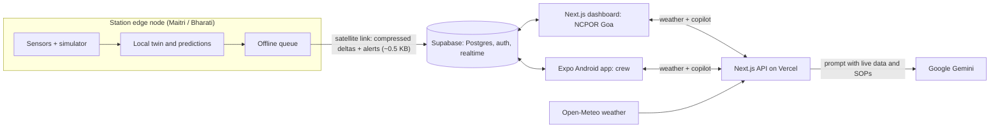

All derived numbers come from one shared TypeScript package (`shared/`), so the website, the app and the copilot always agree. These include the fuel runway, anomaly detection, safety index, field-trip verdicts, compliance figures and daylight.

## Tech stack

| Layer | Technology |
| --- | --- |
| Web | Next.js 16 (App Router), TypeScript, Tailwind CSS 4, shadcn/ui, Recharts, React Three Fiber + drei, lucide-react |
| Mobile | Expo SDK 57 (React Native), Expo Router, react-native-svg, expo-camera, expo-notifications, NetInfo, AsyncStorage |
| Backend | Supabase: Postgres, row-level security, auth, realtime |
| AI copilot | Google Gemini (`gemini-3.5-flash`, falling back to `gemini-flash-latest`) through a Next.js API route |
| Weather | Open-Meteo forecast API (no key) |
| Shared logic | `shared/`: deterministic time-seeded simulator, predictions, playbooks |
| Hosting / build | Vercel (website), EAS Build (Android APK) |

## Folder structure

```
Polaris-Twin/
├── shared/            Pure TypeScript used by both apps (types, simulator, predictions, playbooks)
├── sync-shared.sh     Copies shared/ into web/src/shared and app/shared (edit shared/, never the copies)
├── web/               Next.js website: landing page, dashboard, API routes (weather, copilot)
├── app/               Expo Android app for the crew
├── supabase/
│   └── schema.sql     Tables, demo RLS policies, realtime and seed data
└── docs/              SOPs, screenshots, presentation and video material
```

## Run it locally

You need Node.js 20 or newer, a Supabase project and a Gemini API key.

1. **Database.** In the Supabase SQL editor, run [`supabase/schema.sql`](supabase/schema.sql), then create a user under Authentication → Users.
2. **Shared code.** From the repo root: `bash sync-shared.sh`.
3. **Website**
   ```bash
   cd web
   cp .env.example .env.local   # then fill in the values
   npm install
   npm run dev                  # http://localhost:3000
   ```
4. **App**
   ```bash
   cd app
   cp .env.example .env         # then fill in the values
   npm install
   npx expo start               # scan the QR code with Expo Go
   ```
5. **APK.** From `app/`: `eas env:push preview --path .env`, then `eas build -p android --profile preview`.

### Environment variables

| Website (`web/.env.local`) | App (`app/.env`) |
| --- | --- |
| `NEXT_PUBLIC_SUPABASE_URL` | `EXPO_PUBLIC_SUPABASE_URL` |
| `NEXT_PUBLIC_SUPABASE_ANON_KEY` | `EXPO_PUBLIC_SUPABASE_ANON_KEY` |
| `GEMINI_API_KEY` | `EXPO_PUBLIC_API_BASE` (the website URL) |
| `GEMINI_MODEL` (optional) | `EXPO_PUBLIC_DEMO_PASSWORD` (optional) |
| `NEXT_PUBLIC_DEMO_PASSWORD` (optional) | |

Never commit real values. Both apps ship `.env.example` files with empty values.

## What is simulated

- **Sensor readings** (temperatures, wind, generator load, coolant, vibration, fuel, water, battery) come from a deterministic simulator in `shared/simulator.ts`. Every viewer sees the same values at the same moment. Values follow daily and seasonal cycles, with occasional blizzards.
- **Weather** is real Open-Meteo data when online; the simulator fills in when it is not.
- **Fuel stocks, inventory, alerts, incidents, check-ins and compliance records** start from illustrative seed data in `supabase/schema.sql`.
- **SOPs and emergency playbooks** (`docs/sops.md`) are prototype procedures based on public information. They are **not official NCPOR procedures**.
- Station coordinates and establishment years are public figures; crew sizes are approximate.

## Future scope

- **Real sensors:** generators, tanks, weather masts and building systems publishing over MQTT to an on-station broker, replacing the simulator.
- **Edge server per station:** a small hardened server at Maitri and Bharati running the twin, predictions and the offline queue locally, so the station keeps full capability with no link.
- **Satellite-aware sync:** schedule and compress sync around satellite passes and link quality, with priority lanes for SOS and critical alerts.
- Maintenance history and spare-part ordering linked to the ISEA resupply manifest.
- Offline speech input for the copilot, for gloved hands in the field.

## Acknowledgements

Smart India Hackathon 2026 · PS 26060 · Ministry of Earth Sciences / National Centre for Polar and Ocean Research (NCPOR). Weather data from [Open-Meteo](https://open-meteo.com).
